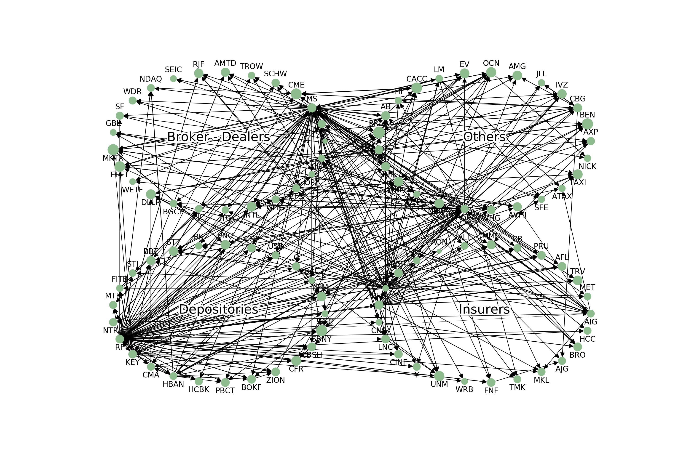
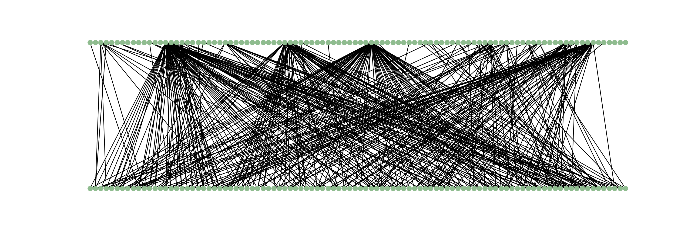
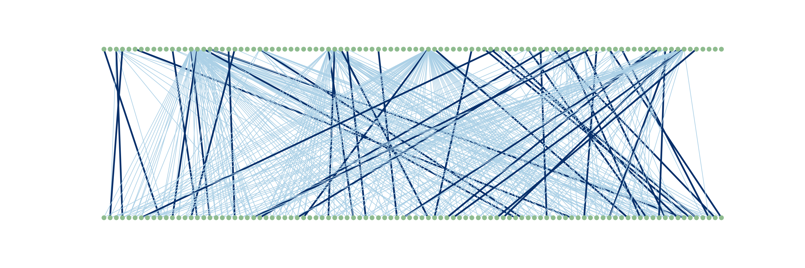
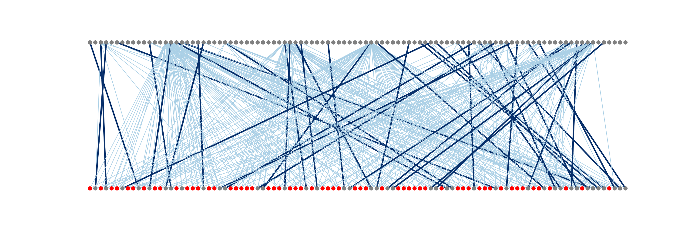
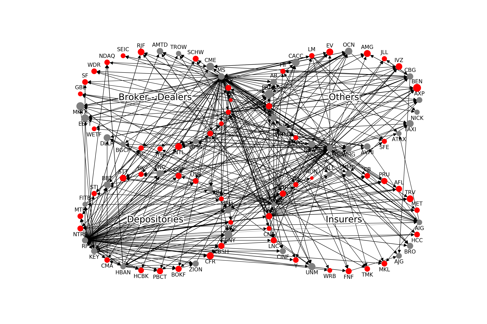

# Controllability of Risk in Financial Networks

This is my final project for the seminar Network Games and Mechanism Design for the [Thematic Einstein Semester of the MATH+ Excellence Cluster](https://www3.math.tu-berlin.de/combi/dmg/TES-Summer2019/index.html) and was presented [at the final workshop](https://www3.math.tu-berlin.de/combi/dmg/TES-Summer2019/final_workshop.html). I apply the concept of graph controllability to a network of financial instituitions and compute the Minimum Input/Driver Node Set. 

## Approach

We start with an adjency matrix and convert it to a graph. We cluster the 100 instutions by sector for visualisation purposes. Then, we would like to obtain the Minimum Input / Driver Node set. To do this, we do the following steps.

1. Obtain correspoding bipartite graph of the original DiGraph.

  
   

2. Find a maximum matching of this bipartite graph. Just like the Minimum Input / Driver Node set, the maximum matching is not necessarily unique. Thus, we use maximum weight matching, to make a principled selection from the set of possible solutions.

  
   

3. Find the unmatched nodes of the "In"-set of the bipartite graph (colored red), which are one possible Minimum Input / Driver Node set.

  

4. Project the found Minimum Input / Driver Node set back to the original graph.

  

## Background

The dataset on quantile regression of daily returns of financial institutions. The idea is that to capture risk for a given institution, we are not interested in knowing how its returns are generally related to the returns of all the other institutions, but instead we are interested how its worst returns (in this case, lowest 5%) are related to the other institutions.

For each timestep, we do a quantile lasso regression for each institutions of all the other institutions, which gives us n-1 coeffients plus an intercept per institutions. We use 100 institutions, and thus have a 100x100 matrix for each timestep. We interpret this as an adjacency matrix to obtain a directed graph for each timestep.

Controllability is an interesting concept from network science. For instance, it has been applied to [identify essential motor neurons in the brain of a worm](https://www.ncbi.nlm.nih.gov/pmc/articles/PMC5710776/), i.e. the neurons that are essential drivers of the worm's movement. The question of this project was whether it can also be used to identify the key drivers of risk in the financial sector. Those could then be, for instance, be monitored especially strictly by regulators.

## Takeaways

As our graphs are relatively sparse (refer to the adjecency matrix heatmap, LASSO forces many coefficients to 0, which is desired in this case), our Minimum Input / Driver Node set has many members - which makes it harder to interpret. Furthermore, the Minimum Input / Driver Node set does not take edge weights into account. Thus, the interpretation of the results is still not straightforward.

This repository contains:
- Two adjacency matrices from the FRM (data/)
- [A jupyter script with all the code](https://github.com/ANGELMAN-J/Network-Games-and-Mechanism-Design-SS19/blob/master/Controllability%20of%20Financial%20Networks%20-%20Minimum%20Input%20Set.ipynb)
- Plot outputs
- [PDF of the slides for my presentation](https://github.com/ANGELMAN-J/Network-Games-and-Mechanism-Design-SS19/blob/master/20190628%20Network%20Games%20and%20Mechanism%20Design.pdf)
